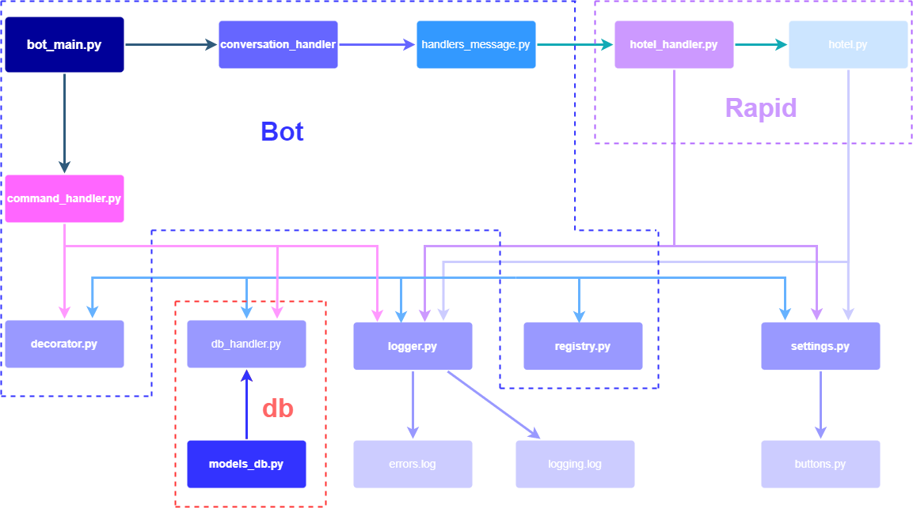

*Данные репозитория являются интеллектуальной собственностью автора и не подлежат копирования без согласования.*

## Бот для поиска отелей. Краткое описание
Бот построен на базе API telegram с использованием библиотеки python-telegram-bot. 
Взаимодействие с пользователем производится путем диалога. Для начала работы с ботом пользователю 
необходимо ввести или выбрать команду из меню, в дальнейшем происходит ее выполнение (список доступных 
команд представлен ниже).

При выполнении команд lowprice, highprice и bestdeal пользователю задается ряд вопросов, при ответе 
обрабатываются значения и/или тексты, которые вносятся в базу данных для сохранения истории. 

База данных построена на SQLight с использованием ORM peewee. База данных состоит из двух таблиц ("один ко многим"):
1. таблица с данными о пользователях(поля: id, user_id, date_request, user_name), 
2. таблица с данными о выполненных запросах пользователей (поля: user_id, date_request, command_request, 
city_request, hotels (JSON)). 

Для поиска отелей используется сайт hotels.com и API rapid.api. Запрос и его обработка производится в отдельном
слое приложения rapid.

Интерфейс бота удобен для взаимодействия с пользователем. "Юзабилити" приложения достигается
за счет использования библиотеки python-telegram-bot-calendar для выбора даты заезда и выезда из отеля, а также 
возможности выбора с помощью кнопок некоторых ответов или ввода ответов с клавиатуры.

### Выполняемые команды:
1. /start:  Начало работы 
2. /history:  Показать историю (последние 5 действий) 
3. /help:  Показать возможности 
4. /lowprice: Поиск отелей по минимальной цене 
5. /highprice: Поиск отелей по максимальной цене 
6. /bestdeal: Поиск отелей по удаленности от центра

### Диаграмма файлов приложения

## Подробное описание работы команд
### start
Команда для начала работы с ботом. В ответ направляется приветствие и заносятся данные пользователя в БД.
### history
Направляются данные о последних 5-ти действиях пользователя. Данные о поиске отеля представляются в следующем виде:
каждый запрос отправляется 1 сообщением, которое содержит дату и время запроса, команду запроса (lowprice, 
highprice или bestdeal), город и найденные отели при запросе (название отеля и его url-адрес).
В случае, если запросов было 4 или меньше, последним отправленным сообщением будет информация о начале общения 
с ботом (дата).
### help
Отправляет сообщение с командами бота и кратким их описанием
### lowprice
Поиск отелей по минимальной стоимости. При вводе этой команды начинается "диалог" с пользователем по принципу
вопрос/ответ, при этом происходит информирование пользователя о запущенной команде и возможности отмены с помощью 
ключевого слова *cancel*:
1. Введите город 
2. Выберите дату заезда (используется выбор с помощью календаря)
3. Выберете дату выезда (аналогично предыдущему)
4. Введите количество проживающих в 1 номере (реализован ввод числа с кнопок и с клавиатуры, 
а также проверка вводимого числа, в случае неверного ввода отправляется сообщение об ошибке)
5. Выберете кол-во отелей или введите другое значение (аналогично предыдущему)
6. Выберете количество фото (аналогично предыдущему)
7. Проверка данных. Начать поиск (Да/Нет)

В случае, если пользователь выбирает поиск отелей, производится запрос отелей и обработка данных. В случае 
отсутствия ошибок и при положительном результате поиска отелей производится запись запроса в БД. 

Далее отправляются сообщения об отелях:
1. Название отеля
2. Количество звезд
3. Адрес отеля
4. Рейтинг
5. Удаленность от центра, км
6. Цена за ночь, руб
7. Общая цена, руб
8. Сайт отеля на hotels.com
9. При выборе количества фото, отправляются фотографии медиа группой.

### highprice
Логика работы команды аналогична предыдущей команде lowprice, однако здесь производится сортировка отелей 
по *максимальной* стоимости

### bestdeal
Логика работы похожа на две предыдущие команды, однако в bestdeal сортировка отелей производится по удаленности 
от центра города. Кроме того, пользователю предлагается ввести еще 2 параметра: диапазон цен поиска, а также 
радиус, в котором необходимо искать отели.
